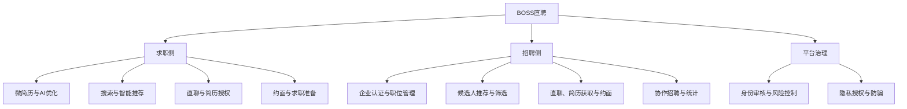
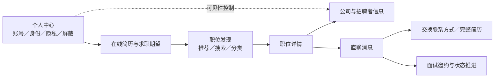
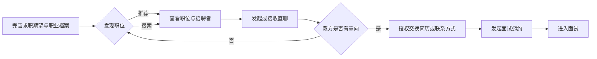

# 鱼泡直聘竞品分析报告

## 目录

1. 竞品分析目的
2. 市场分析
3. 竞品选择
4. 战略层分析
5. 范围层分析
6. 结构层分析
7. 核心功能及信息展示分析
8. SWOT 分析
9. 综合结论与建议

# 01 竞品分析目的

## 一句话结论

本次分析旨在判断鱼泡直聘能否在中国白领招聘市场找到兼具**市场需求、能力适配、竞争差异和商业价值**的细分切入口，并为进入决策与试点规划提供依据。

## 分析任务

| 项目 | 分析范围 |
|---|---|
| 分析产品 | 鱼泡直聘 |
| 分析目标 | 评估鱼泡直聘进入白领招聘领域的市场、竞争、产品及商业可行性 |
| 市场范围 | 中国市场 |
| 时间范围 | 近一年，更早资料仅用于必要的历史对照 |
| 白领市场范围 | 办公室职能、销售、运营、专业服务及部分专业技术岗位 |
| 核心竞品 | BOSS直聘 |
| 决策用途 | 支持业务立项、细分市场选择、产品定位、试点设计及能力建设 |

## 核心判断框架

进入白领市场不能简单理解为增加白领职位分类，而要判断能否形成独立、可持续的业务价值。可行性需同时满足四项条件：

1. **目标市场具有吸引力：**存在稳定招聘需求、足够企业预算和可持续的人才供给。
2. **鱼泡能力可以迁移：**既有企业客户、用户流量、区域网络和快速招聘能力能够服务白领场景。
3. **能够建立明确差异：**在目标岗位、区域、企业类型或招聘效率上形成相对优势，避免与综合平台全面同质化竞争。
4. **商业路径可以成立：**企业获客、职位运营、匹配转化、客户续费和安全治理成本处于可承受范围。

因此，本次分析不预设鱼泡应全面进入综合白领招聘市场，而是重点寻找与现有客户和招聘场景关联较强的岗位及企业群体。BOSS直聘作为核心比较基准，分析重点也不局限于产品功能，而是其供需网络、品牌心智、匹配效率和商业化能力形成的进入壁垒。

最终决策应落在“进入、条件性试点或暂缓”三种选择之一，并明确目标客群、切入场景和能力建设优先级。

# 02 市场分析

## PEST宏观分析

**宏观环境支持鱼泡试探白领招聘，但机会主要集中于服务业、新职业和高校毕业生等结构性市场。监管、隐私与算法治理要求同步提高，更适合从邻近垂直岗位分阶段进入，而非直接复制综合招聘平台。**

| 维度 | 近一年市场变化 | 对鱼泡的影响 |
|---|---|---|
| 政策与监管 | 政策继续强调稳岗扩容、增强服务业就业带动能力，并推动适应人工智能发展的就业服务。网络招聘监管进一步要求平台具备相应许可，落实实名与资质核验、招聘信息审查、风险监测和违法信息处置。 | 数字化就业服务获得支持，但企业认证、职位真实性、歧视性条件识别、投诉处置和个人信息保护已成为进入白领市场的基础门槛。 |
| 经济与就业 | 2026年上半年服务业增加值为41.4万亿元，同比增长5.2%，占GDP的59.5%，对经济增长贡献率为66.1%；同期全国城镇调查失业率均值为5.2%。 | 服务业仍是岗位扩容的重要载体，但市场并非全面高增长。平台机会更多来自结构性岗位和匹配效率提升，而不是依赖普遍性的招聘需求扩张。 |
| 社会与人才 | 2026届高校毕业生预计达到1270万人，青年就业服务和岗位供给仍是政策重点。 | 初级白领和专业岗位具有充足人才供给，但筛选压力随之增加。平台需要强化职业能力、岗位成长性、企业可信度和薪酬信息的表达。 |
| 技术环境 | 截至2025年12月，中国网民规模为11.25亿，互联网普及率为80.1%，生成式人工智能用户规模达6.02亿。“人工智能+”行动推动人机协同和新岗位发展，同时强调防范算法歧视与模型黑箱。 | AI可用于职位解析、简历生成、匹配推荐和求职辅助，但涉及候选人排序与筛选时，需要保留人工校正、结果解释、偏差监测和申诉机制。 |

## 行业背景分析

中国网络招聘市场需求基础仍然较大，但行业已由流量扩张转向**供需密度、匹配效率、招聘安全和企业续费**竞争。2024年网络招聘市场规模约183亿元，同比增长1.6%；预计2025年约192亿元、2026年约203亿元。市场保持增长，但已进入成熟竞争阶段，新进入者仅依靠免费发布职位或广告获客难以形成长期壁垒。

白领供需呈现明显结构性分化。一方面，城镇就业和高校毕业生规模为白领及初级专业岗位提供了持续供给；另一方面，岗位机会更多集中在AI与数字化服务、先进制造配套、专业服务、消费服务和校招等领域，并非所有传统办公室岗位同步增长。

头部平台的双边网络构成主要进入壁垒。2026年第一季度，BOSS直聘平均月活跃用户为6090万，3月单月月活超过7200万；过去12个月付费企业客户达到710万。上述数据为全平台口径，但反映出其已经具备较强的企业覆盖、人才活跃度、匹配数据和商业化基础。鱼泡若直接覆盖全国、全行业白领岗位，将正面面对其规模、品牌和网络效应优势。

AI虽然能够降低职位生成、简历处理和候选人筛选成本，但不能替代企业核验与供需运营。进入白领市场还会增加职位分类、人才标签、模型治理、隐私保护和投诉处置成本。

### 行业进入判断

| 行业环节 | 竞争焦点 | 对鱼泡的要求 |
|---|---|---|
| 企业供给 | 真实企业、有效职位和招聘预算 | 先在特定行业和区域形成稳定岗位密度 |
| 平台匹配 | 推荐准确性、响应率、面试率和安全性 | 不能只以职位量和注册量衡量业务成效 |
| 求职供给 | 活跃人才、完整简历和明确求职意向 | 优先承接校招及蓝白领交叉人群 |
| 商业化 | 招聘效果、企业续费及增值服务 | AI和招聘工具必须建立在实际转化效果之上 |

## 对鱼泡直聘的启示

1. **从邻近岗位侧翼进入。**优先考虑销售、客服、门店运营、项目协调、技术服务、工程管理、制造业技术岗和基层管理等“轻白领”或蓝白领交叉岗位。
2. **以局部供需密度代替全品类覆盖。**聚焦少数城市、行业或企业类型，先形成“职位充足—回复及时—面试可达”的闭环，再逐步扩张。
3. **将可信招聘建设为基础能力。**建立企业主体复核、职位有效期、薪酬完整度、异常职位识别、反“招转培”、投诉闭环及简历数据分级授权机制。
4. **用AI改善匹配而非单纯增加曝光。**优先投入岗位标准化、技能标签和人岗适配，同时防范算法歧视和不可解释筛选。
5. **以业务结果判断可行性。**核心指标应包括有效白领职位数、企业回复率、面试与入职转化率、企业续费率及虚假招聘投诉率。在形成稳定结果前，白领业务应被定义为有条件可行。

# 03 竞品选择

## 选择标准与候选名单

本次仅选择BOSS直聘作为核心直接竞品，以集中判断鱼泡进入主流白领招聘市场时，在用户、岗位、匹配机制、信任体系和商业化能力上的差距。

竞品筛选采用用户重合度30%、需求重合度30%、场景重合度20%、市场定位相似度10%、数据可获得性10%的加权模型。BOSS直聘在用户、招聘需求和直接沟通场景上与鱼泡高度重合，综合得分为4.9分，是最适合检验鱼泡白领化可行性的核心样本。

| 产品 | 竞品类型 | 综合评分 | 入选理由 |
|---|---|---:|---|
| BOSS直聘 | 直接竞品／核心标杆 | 4.9/5 | 覆盖白领、蓝领和学生等招聘人群，与鱼泡在移动招聘、双边用户运营和直接沟通场景上高度重合 |

本次不纳入前程无忧、智联招聘和猎聘，不代表其缺乏行业参考价值，而是传统简历库及中高端猎头模式与鱼泡当前产品路径差异较大。聚焦BOSS直聘有利于深入识别鱼泡既有的快速连接能力能否迁移至白领市场。

## BOSS直聘基础信息

| 字段 | 基础信息 |
|---|---|
| 产品名称 | BOSS直聘，2014年成立，主要产品为移动招聘应用 |
| 上市主体 | 看准科技有限公司（KANZHUN LIMITED） |
| 核心定位 | 通过即时直聊、智能推荐和移动端交互连接求职者与招聘者 |
| Slogan | 找工作，BOSS直聘直接谈！ |
| 目标用户 | 覆盖白领、金领、蓝领、大学生，以及不同行业和规模的企业用户 |
| 主要场景 | 全职、实习、跳槽与企业招聘；求职者可浏览推荐职位并直接沟通，企业可发布职位、搜索或接收候选人推荐 |
| 规模信号 | 2026年第一季度平均月活跃用户6090万，过去12个月付费企业客户710万 |
| 竞品属性 | 与鱼泡计划进入的白领招聘市场在用户、需求和使用场景上高度重合 |

BOSS直聘代表的是成熟综合招聘平台，而非单一白领垂类产品。其核心壁垒不是职位分类数量，而是“直聊＋推荐”机制、供需网络、活跃行为数据、企业品牌和付费基础共同形成的匹配效率。

鱼泡已经覆盖市场、技术、产品、设计和人事行政等白领岗位，双方业务边界呈现双向渗透。但鱼泡更可行的路径不是全面复制BOSS直聘，而是优先服务基层白领、灰领、蓝白领交叉岗位，以及同时招聘办公室岗位与一线岗位的中小企业。

后续对标应围绕四项核心能力展开：

- **岗位供给：**有效白领职位的数量、质量与区域密度；
- **人才表达：**简历、技能标签、职业身份和求职意向的完整度；
- **匹配转化：**推荐相关性、招聘者响应率、面试率和入职率；
- **企业经营：**招聘工具、客户留存、付费意愿和安全治理能力。

BOSS直聘应被视为鱼泡进入白领市场必须跨越的基准线，而非简单复制对象。其平台总用户规模只能用于判断竞争门槛，不能直接等同于白领用户规模；鱼泡的进入决策最终仍应以目标细分市场中的有效供需和商业转化结果为依据。

# 04 战略层分析

## BOSS直聘战略层分析

**核心判断：**BOSS直聘是覆盖多行业、多地域及多职业层级的综合招聘平台，白领是其高价值用户群，但并非唯一定位。其竞争优势来自直聊模式、算法匹配、双边用户规模与企业付费体系的协同。

### 战略定位与增长逻辑

| 战略要素 | 主要做法 | 形成的能力 |
|---|---|---|
| 用户覆盖 | 覆盖白领、金领、蓝领、学生及不同规模企业 | 建立跨行业人才池与双边网络效应 |
| 核心体验 | 智能推荐、招聘者直聊、简历授权 | 降低求职等待成本，提高互动意愿 |
| 企业服务 | 职位发布、人才连接及招聘增值工具 | 提高招聘效率并推动企业付费 |
| 商业模式 | 企业侧付费为主，求职基础服务免费 | 兼顾用户增长与商业转化 |

BOSS直聘将传统“搜索职位—投递简历—等待反馈”改造成“推荐匹配—直接沟通—双方确认—推进面试”。求职者可以先通过微简历建立联系，再决定是否发送完整简历或联系方式，从而兼顾沟通效率与隐私控制；企业则通过推荐和直接沟通主动识别候选人。

2025年，BOSS直聘企业在线招聘服务收入为81.93亿元，占总收入超过99%。截至2026年3月31日的十二个月付费企业客户达到710万，2026年第一季度平均月活跃用户为6090万。庞大的求职者和企业用户池能够产生更多互动数据，继续改善推荐质量和匹配效率，进而推动企业付费，形成“规模—数据—体验—商业化”的增长循环。

## 战略层分析横向总结

**核心判断：**鱼泡直聘具备进入白领招聘的用户、企业和产品基础，但不宜与BOSS直聘争夺全国全行业的主流白领市场。更可行的路径是聚焦蓝白领边界岗位、二三线城市中小企业以及应届和初级人才。

| 战略维度 | 鱼泡直聘 | BOSS直聘 | 业务判断 |
|---|---|---|---|
| 平台定位 | 从蓝领招聘向白领、学生及企业服务延伸 | 已形成全职业人群综合平台 | 定位逐渐接近，但品牌认知与用户结构不同 |
| 核心资产 | 下沉用户、蓝领招聘经验、工程及混合用工企业资源 | 白领人才、招聘者、互动数据和企业付费网络 | 鱼泡应迁移既有优势，而非复制BOSS路径 |
| 用户价值 | 强调快速联系、岗位真实性和招聘成本 | 强调智能匹配、直聊和活跃人才池 | 直聊只能成为基础能力，不能单独构成差异化 |
| 能力延伸 | 已布局校招、ATS及企业服务 | 已形成成熟企业招聘商业化体系 | 鱼泡可围绕混合用工提供组合服务 |

销售、客服、运营、行政、基层管理、工程技术和生产管理等岗位，与鱼泡现有用户、企业及地域资源的衔接更强，适合作为白领业务冷启动入口。成熟互联网、金融及高端专业岗位对人才密度、企业品牌和专业信息要求更高，不宜作为首批正面竞争领域。

鱼泡应以城市和岗位为单位推进试点，重点观察有效职位供给、简历完整率、沟通响应率、面试转化率、30日留存和企业付费转化。只有形成稳定的局部供需密度后，才应扩展至更多城市、职类和薪资层级。

---

# 05 范围层分析

## BOSS直聘范围层分析

**核心判断：**BOSS直聘已经形成覆盖白领招聘主要环节的双边功能体系，其产品主干是“智能推荐—双向直聊—简历授权—约面推进”，简历工具、招聘协作与安全治理围绕这一主干展开。

### 功能范围

求职侧覆盖微简历、职位搜索与推荐、直聊、完整简历授权、面试衔接、AI简历优化和面试训练；招聘侧覆盖企业与招聘者认证、职位发布、候选人推荐、沟通、简历获取、筛选约面、协作招聘和统计。文字、语音、图片等消息形态进一步降低了初步接触门槛。

推荐与沟通并非两个独立模块。平台先根据简历、求职意向和互动行为推荐职位或候选人，再通过直聊确认实际需求；完整简历和联系方式在建立意向后授权交换。该设计减少无效投递，也让推荐结果能够通过真实互动持续校正。

## 范围层分析横向总结

**核心判断：**鱼泡直聘已经具备白领招聘的基础功能框架，进入该市场无需重建平台，但需要将投入重点从增加职位分类转向完善招聘闭环和专业化工具。

| 功能模块 | 鱼泡直聘 | BOSS直聘 | 优先判断 |
|---|---|---|---|
| 职位分类、搜索与推荐 | 已支持 | 已支持 | 基础能力不是主要差距 |
| 在线简历、投递与沟通 | 已支持在线及电话沟通、批量或一键投递 | 已支持直聊、投递和简历授权 | 竞争重点转向匹配质量与信息连续性 |
| AI辅助 | 已设置AI求职助手 | 覆盖AI搜索、推荐及求职辅助 | 需围绕实际转化场景深化 |
| 面试与录用 | 当前能力更集中于找职位、沟通和简历筛选 | 已覆盖约面及状态推进 | 应作为鱼泡的重点补强环节 |
| 企业协作 | 已具备简历排序、筛选和ATS基础 | 已覆盖筛选、约面、协作及统计 | 决定能否服务组织化招聘 |

鱼泡官网已经设置产品、运营、人力资源、财务法务、设计、金融和教育等白领职位分类，并延伸至校园招聘和企业招聘工具，说明其业务边界已进入白领场景。下一阶段不应继续以“新增更多白领频道”为主要成果，而应完善以下能力：

1. **结构化履历：**增加项目经历、作品集、专业技能、职业证书和求职意向等信息，提升白领匹配依据。
2. **招聘流程：**连接筛选、约面、面试反馈、录用结果和候选人状态，减少流程断点。
3. **企业协作：**支持多招聘者共享候选人、分配任务、记录评价和查看招聘统计。
4. **隐私与信任：**按企业、职位和沟通阶段控制简历及联系方式可见范围。
5. **差异化效率：**保留电话直联、地域匹配和快速入职优势，但将其嵌入完整的站内招聘记录。

---

# 06 结构层分析

## BOSS直聘结构层分析

**核心判断：**BOSS直聘围绕“发现职位—判断机会—直接沟通—推进面试”组织求职任务。直聊不是附属工具，而是连接职位、公司、招聘者、简历和面试状态的结构中枢。

### 核心对象与任务关系

平台以“职位—公司—招聘者—求职者”的关系组织信息，而不是只围绕投递记录展开。在线简历和求职期望影响职位推荐；进入职位详情后，用户可以查看公司及招聘者信息并直接沟通；简历、联系方式和面试邀约继续在同一招聘关系中流转。因此，消息中心同时承担沟通入口和求职进度枢纽的作用。

个人中心集中承载资料、求职意向、账号安全、隐私、屏蔽和身份管理。这些设置不仅用于账户管理，还会直接影响职位推荐、企业可见范围和沟通权限，使用户资产、匹配逻辑与隐私治理保持关联。

## 结构层分析横向总结

**核心判断：**鱼泡直聘已覆盖职位浏览、筛选、投递、在线聊天、电话联系和简历管理，但白领求职需要更连续的任务结构。产品应从“职位信息聚合与快速联系”升级为“职业意向—精准匹配—深度沟通—进度管理”。

| 结构维度 | 鱼泡直聘现状 | BOSS直聘特征 | 鱼泡调整方向 |
|---|---|---|---|
| 任务主线 | 触达方式丰富，强调快速联系 | 推荐、详情、沟通和约面衔接集中 | 收敛白领默认主路径 |
| 分类体系 | 蓝领、服务业、制造业及白领职位并存 | 围绕职业意向和多维筛选组织 | 建立独立、一致的白领职位体系 |
| 沟通结构 | 同时支持在线聊、电话聊及联系方式交换 | 聊天绑定职位、简历和后续状态 | 提高站内上下文连续性 |
| 进程管理 | 重点集中于投递、联系和简历处理 | 从沟通延伸至约面和状态推进 | 建设统一应聘进度中心 |
| 账户结构 | 可复用既有用户与沟通底座 | 统一账户承载求职和招聘关系 | 共享底层能力，区分白领任务空间 |

鱼泡不宜直接把更多白领职位叠加到现有岗位目录中，否则容易造成工种、职能、行业和经验维度混杂。建议采用“共享账户与沟通底座、独立白领任务空间”的渐进式结构：底层继续复用身份、消息、企业和安全能力，前台则为白领用户建立职能、行业、经验、职级、公司类型和工作方式等连续分类。

白领默认路径应收敛为“推荐或搜索—职位详情—站内沟通—简历授权—约面—进度跟踪”。电话直联可以继续作为高效率选项，但沟通对象、对应职位和后续结果应回流站内记录。应聘进度中心则统一展示已投递、已沟通、简历查看、待面试和结果状态，为周期更长、同时处理多个机会的白领求职者提供确定感。

# 07 核心功能及信息展示分析

## BOSS直聘核心流程

BOSS直聘以“职位发现—直接开聊—双向授权简历—面试邀约”为核心闭环，将传统招聘中的单向投递转化为面试前的持续互动和双向筛选。

1. **建立职业档案。**求职者先填写个人及职业信息，形成平台内简历和求职期望，系统据此提供个性化职位推荐。
2. **推荐与搜索并行。**推荐流降低重复设置条件的成本，搜索入口承接目标明确的求职任务。对白领用户而言，公司、岗位职责、薪资、地点和经验要求是进入沟通环节前的关键决策信息。
3. **直聊承担核心转化。**求职者和招聘者均可发起沟通，通过文字、语音、图片等方式确认岗位要求、候选人背景及求职意向，再决定是否继续推进。
4. **敏感信息双向授权。**未经求职者同意，招聘者不能查看完整简历或联系方式；求职者发送完整简历也需要对方同意。双方形成意向后，再进入面试邀约与接受环节。

该流程的价值不只是缩短投递路径，而是通过沟通和分阶段授权提高匹配质量。其效率仍依赖招聘者响应速度、职位信息完整度以及双方档案的准确性。

## BOSS直聘核心页面

| 核心页面 | 信息与操作重点 | 业务价值 |
|---|---|---|
| 推荐／搜索结果页 | 通过信息流推荐和主动搜索承接职位发现，并依据用户资料及行为提供个性化结果 | 帮助用户快速比较职位，减少无效浏览 |
| 职位详情页 | 展示岗位信息，并连接招聘者和直接沟通入口 | 将岗位条件、企业可信度和招聘者信息转化为沟通决策 |
| 消息／聊天页 | 支持岗位咨询、简历授权、联系方式交换和面试邀约 | 把“投递后等待”转化为双向确认，是核心转化页面 |
| 在线简历／我的页面 | 管理工作经历、教育经历、求职期望、简历隐藏、公司屏蔽和身份切换 | 同时承担匹配数据维护、曝光管理和隐私控制 |

BOSS直聘的页面组织围绕同一任务链展开：简历和求职期望为推荐提供基础，结果页与详情页完成初步筛选，聊天页完成匹配确认，简历授权和面试邀约推动后续转化。页面之间的连续性比单个功能数量更重要。

## 核心体验横向总结

鱼泡直聘已覆盖职位推荐与搜索、筛选、批量投递、简历展示、在线沟通、沟通助手和候选人排序，进入白领招聘不存在明显的基础功能断点。与BOSS直聘相比，主要差距已经从“有没有功能”转向“信息是否专业、匹配是否可信、沟通后能否持续推进”。

| 体验环节 | 鱼泡直聘 | BOSS直聘 | 横向判断 |
|---|---|---|---|
| 发现机会 | 推荐、搜索、筛选、附近职位、批量投递 | 搜索推荐、职位匹配、求职期望 | 鱼泡基础能力较完整，但白领信息颗粒度需要加强 |
| 建立联系 | 在线沟通、沟通助手、会话与候选人排序 | 直聊、消息管理、智能匹配 | 功能趋同，沟通入口本身难以形成差异化 |
| 推进决策 | 简历展示与管理、候选人排序 | 简历授权、约面、面试及招聘协作 | BOSS覆盖的决策链路更深 |
| 安全信任 | 人工审核、收藏、拉黑与安全策略 | 审核、实地核验、风控和隐私授权 | 鱼泡需要强化页面级、可感知的信任证据 |

鱼泡的优势偏向快速建立供需联系，BOSS则更强调复杂招聘中的持续比较、评估和流程推进。鱼泡进入白领市场时，应优先完成三项建设：一是完善职位信息模型和多维筛选；二是突出企业认证、岗位时效、薪酬结构和招聘者身份；三是补强沟通后的约面、反馈和进度管理。在线简历也不应只是资料档案，而应成为推荐、求职期望、曝光控制和沟通转化的统一数据中心。

# 08 SWOT 分析

| 维度 | 核心判断 | 对进入白领市场的影响 |
|---|---|---|
| 优势 Strengths | 鱼泡已形成推荐、搜索、筛选、简历、在线沟通、智能匹配和安全审核等基础能力；平台用户、企业和岗位规模持续扩大，覆盖全国多数地区 | 现有产品、流量和企业资源可以复用，有利于降低从零搭建白领招聘平台的成本 |
| 劣势 Weaknesses | 现有体验更偏快速撮合，对白领岗位所需的信息颗粒度、精细筛选、简历表达、约面及招聘进度管理支持相对不足；品牌与蓝领招工联系较强 | 若直接扩展为全品类白领平台，容易出现用户认知、岗位质量和产品体验不匹配 |
| 机会 Opportunities | 近一年就业市场总体稳定，结构性就业矛盾仍然存在，服务业、信息传输等行业持续释放就业潜力；中小企业、非一线城市和蓝白领交叉岗位与鱼泡现有能力具有较高衔接度 | 可从既有供需网络自然外溢，不必直接争夺高端和专业人才市场 |
| 威胁 Threats | BOSS直聘已形成较强的用户规模、付费企业基础和网络效应，并持续优化搜索、推荐、消息、简历和面试场景 | 常规推荐、即时沟通和职位数量无法构成有效壁垒，同质化进入将面临较高获客和供给竞争压力 |

综合来看，鱼泡具备进入白领招聘的产品基础和资源迁移条件，但优势集中在广覆盖、下沉市场和快速撮合，而非高端人才服务。机会应限定在能够复用现有企业关系、地域覆盖和招聘效率的细分场景。

主要矛盾有两项：第一，快速撮合逻辑能否升级为适合白领招聘的持续决策链路；第二，平台审核能力能否转化为企业、岗位和招聘者层面的可见信任。若职位职责模糊、薪酬不透明、岗位过期或企业信息不足，即使沟通量增长，也难以沉淀白领用户和企业付费。

因此，进入策略不应是复制BOSS直聘，而应围绕细分人群和场景建立差异。优先方向包括二三线城市、中小企业、基层管理、销售、客服、行政、技工管理以及蓝白领交叉岗位。高端互联网、金融和专业人才岗位不宜作为初期主攻市场。

# 09 综合结论与建议

## 综合结论

鱼泡直聘进军白领行业具备可行性，但应采取“蓝领基本盘外溢、白领细分突破”的渐进路线。现有产品已具备职位发现、简历、匹配、沟通和安全审核等进入基础，但功能完备不等于竞争力成立。面对BOSS直聘已经形成的规模、品牌和网络效应，鱼泡不宜以综合白领招聘平台为初期目标，而应优先验证能够复用现有用户、企业和地域资源的细分市场。

## 增长点与优先级

| 优先级 | 增长点 | 核心动作 | 预期价值 |
|---|---|---|---|
| P0 | 下沉市场白领招聘 | 聚焦二三线城市、中小企业和高频基层白领岗位，建设独立职位供给与运营策略 | 复用现有地域覆盖和企业资源，降低冷启动难度 |
| P0 | 可验证的岗位质量 | 完善企业认证、招聘者身份、岗位时效、薪资构成、办公地点、社保公积金和岗位稳定性展示 | 降低无效沟通，建立白领用户信任 |
| P0 | 白领职位与匹配模型 | 增加行业、职能、经验、学历等结构化字段，优化筛选、推荐和求职期望 | 提高职位相关性和有效沟通率 |
| P1 | 沟通后的招聘推进 | 增加约面、面试状态、反馈和候选人进度管理 | 将沟通量转化为面试与入职结果 |
| P1 | 蓝白领交叉岗位 | 优先服务基层管理、销售、客服、行政和技工管理等岗位 | 形成区别于综合招聘平台的供给特色 |

## 核心风险

1. **品牌认知风险：**原有蓝领招工心智可能影响白领用户对岗位质量和职业发展空间的判断。
2. **供给质量风险：**过期、职责模糊、薪酬不透明或企业信息不足的职位会直接损害新用户信任。
3. **同质化竞争风险：**仅增加白领分类、推荐和直聊，难以对抗BOSS直聘的规模与网络效应。
4. **转化断层风险：**如果产品止步于沟通，缺少约面、反馈和进度管理，沟通增长不会自然转化为招聘完成。
5. **主业稀释风险：**大范围扩张可能分散产品和运营资源，并影响鱼泡原有优势场景的体验。

## 行动建议

1. **明确定位。**将白领业务定义为“面向下沉市场和蓝白领融合岗位的综合招聘入口”，不以全面覆盖白领职业为首期目标。
2. **开展小范围试点。**选择3—5个已有用户和企业基础的城市，开展6个月验证；按城市和职位分别运营，避免将不同供需结构混为一体。
3. **先治理供给，再扩大流量。**建立白领岗位的信息完整度、时效和真实性标准，在推荐、详情和聊天页面展示明确的信任标识。
4. **建立完整转化指标。**重点观察有效简历数、企业回复率、有效沟通率、面试转化率、入职转化率、30日留存和企业复购率。扩张决策应以招聘结果和留存为依据，而非职位量或消息量。
5. **设置阶段性决策机制。**试点有效时再扩展城市和职类；若沟通活跃但面试、入职和复购表现不足，应优先修复职位供给、匹配质量和品牌信任，而不是增加投放。

最终建议为：**可以进入，但必须聚焦切口、控制节奏并以试点结果决定扩张。**鱼泡的关键不是证明自己能够覆盖全部白领岗位，而是找到BOSS直聘覆盖不足、同时能发挥自身下沉覆盖、企业资源和快速撮合能力的细分场景。
